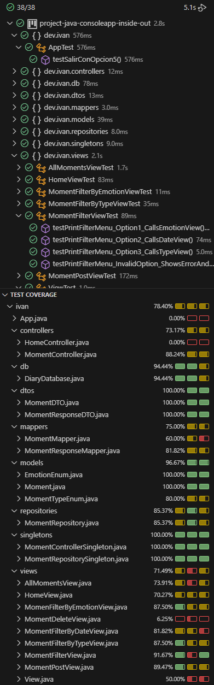

# Mi Diario - Aplicación de Consola

**Descripción:**
Mi Diario es una aplicación de consola que permite a los usuarios gestionar sus momentos vividos. Cada momento tiene una emoción asignada y registra tanto la fecha en la que ocurrió como las fechas de creación y modificación del registro.

## Estructura de un momento vivído
- Identificador único
- Título
- Descripción
- Emoción
- Fecha del momento
- Fecha de creación
- Fecha de modificación

## Emociones disponibles
- Alegría
- Tristeza
- Ira
- Asco
- Miedo
- Ansiedad
- Envidia
- Vergüenza
- Aburrimiento
- Nostalgia

## Historias de usuario y criterios de aceptación

1. **Añadir un momento vivido**
   - **Como:** usuario
   - **Quiero:** añadir un momento vivido
   - **Para poder:** visualizarlo cuando lo necesite recordar
   - **Criterios de aceptación:**
     - Se debe ingresar título, descripción, emoción y fecha del momento.
     - El momento se guarda con un identificador único y fecha de creación.

2. **Recuperar la lista de momentos vividos**
   - **Como:** usuario
   - **Quiero:** recuperar la lista de los momentos vividos registrados
   - **Para poder:** repasarlos
   - **Criterios de aceptación:**
     - Se debe mostrar la lista completa con todos los campos de cada momento.
     - La lista debe estar ordenada por fecha de creación o por fecha del momento.

3. **Suprimir un momento vivido**
   - **Como:** usuario
   - **Quiero:** suprimir un momento vivido
   - **Para poder:** evitar duplicados y mantener la lista organizada
   - **Criterios de aceptación:**
     - El usuario debe poder seleccionar el momento por su identificador.
     - El momento eliminado no debe aparecer más en la lista.

4. **Filtrar momentos por emoción**
   - **Como:** usuario
   - **Quiero:** obtener los momentos vividos según su emoción
   - **Para poder:** visualizarlos
   - **Criterios de aceptación:**
     - El usuario selecciona una emoción.
     - Se muestran todos los momentos que coinciden con la emoción seleccionada.

5. **Filtrar momentos por fecha o mes**
   - **Como:** usuario
   - **Quiero:** obtener los momentos vividos en un mes determinado
   - **Para poder:** revisarlos
   - **Criterios de aceptación:**
     - El usuario ingresa un mes y un año.
     - Se muestran todos los momentos ocurridos en ese período.

6. **Salir del programa**
   - **Como:** usuario
   - **Quiero:** salir del programa
   - **Para poder:** iniciar otro
   - **Criterios de aceptación:**
     - El programa debe cerrarse de manera segura al seleccionar la opción de salida.

##  Pre-requisitos

Antes de ejecutar este proyecto asegúrate de tener instalado:

- [Java 17 o superior](https://adoptium.net/)
- [Maven 3.8+](https://maven.apache.org/) (para gestionar dependencias y compilar el proyecto)

## Pasos para la instalación

1. Clonar este repositorio:
   ```bash
   git clone https://github.com/Ivanlr96/project-java-consoleapp-inside-out
   cd project-java-consoleapp-inside-out
   Ejecutar el programa desde App.java


## Diagrama de Clases


## Tests


## Autor:
Iván Lorenzo
